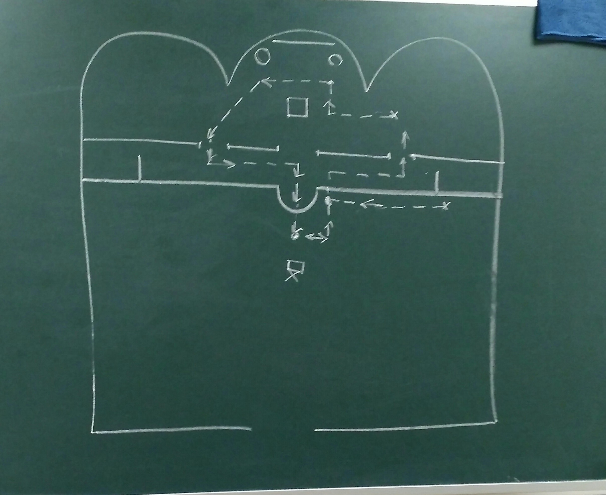

## Практическая литургика 
#### (Зельников М.)

### Чтение Апостола
* На чтении Трисвятого, **приняв книгу**, подходим к Горнему месту (если здесь предстоятель), к образу, **крестимся** (креститься следует, взирая на образ, всегда, т.к. на б-жении важен внешний эл-т м-вы: это предотвращает лишние вопросы)
* к предстоятелю: «**Благослови, владыка, Апостола прочест'и!**», поцеловать поданную руку («владыка» т.к. св-к на литургии — «заместитель» епископа)
* _высоко держа книгу_, выходим в северо-дьяконские врата, пройти по солее к середине храма, к амвону, вниз с амвона и к месту чтения.

* после П: «Мир всем!» — отвечаем: «**И духови твоему!**»
* после Д: «Премудрость!» — читаем **Прокимен**
* после Д: «Премудрость!» — **объявление книги**:
	* Деяний святых Апостол чтение
	* Соборнаго послания Петрова/Иоаннова/Иаковля/Иудина чтение
	* к коринфяном/римляном/эфесеям/солуняном/филипписиям/колоссаям (без цифр) послания святаго апостола Павла чтение
* после Д: «Вонмем!» — **чтение Апостола**
* после П: «Мир ти (чтущему)» — негромко: **«И духови твоему»**
* подойти направо от амвона, перед Царскими Вратами (освободить центр для чтения Евангелия)
* после Д: «Премудрость!» — **возгласы на Аллилуарий**/ответы хора:
	* «Аллилуйя (трижды), глас n»
	* 1-я строчка аллилуария
	* 2-я строчка аллилуария
* поклониться к алтарю, вернуться через правые врата отдать книгу

#### Разделы книги Апостол

* текст Деяний и Посланий
* тексты подвижного годового круга: прокимны, зачала, аллилуарии (и для хора — причастны), позже — недели, где есть только расписание номеров зачал (прокимен и аллилуарий берётся из седмичного круга)
* неподвижный годовой круг
* седмичный круг, нач. с вс (их несколько, на 8 гласов) и далее — будни («дневнiи»)
* «Общие» — подвижн. части б-жения для свв, у кого нет собственных служб, но необходимо послужить ему (напр., в престольный праздник)
* —"— «на всяку потребу»

#### Инструкция по поиску текстов

* в неподвижном годовом круге (праздничные чтения):
	* если есть зачало, прок., алл. -->  выписываем
	* если нет --> значит, только рядовое чтение
* в подвижном годовом круге (рядовые чтения):
	* если есть прокимен и алл. --> выписываем
	* если нет прокимна и алл. --> берём из седм. круга

#### Инструкция по чтению

* зачало написано слева на полях (справа — нумерация стихов)
	* Зач. без номера после Зач. (21) = «зачало (21) от полу», на подобное указание читаем от Зач. без номера
* звздочка у зачала ведёт к сноске, где написано, как начать чтение
* со слов «Преступи (понедельнику)» до слов «Чти понедельнику» — не читается
* конец — на словах «Конец (понедельнику)»

### составные прокимны
При двойном чтении (рядовое + праздник), прок. и алл-й составные.

Составной прокимен: 2 возгласа по первому прок., а вместо повторения первого стиха – "Прокимен, глас 3, Песнь Богородицы…", первый стих второго прок.

Составной аллилуарий: 2 возгласа по первому + первая строчка псалма второго аллилуария.

